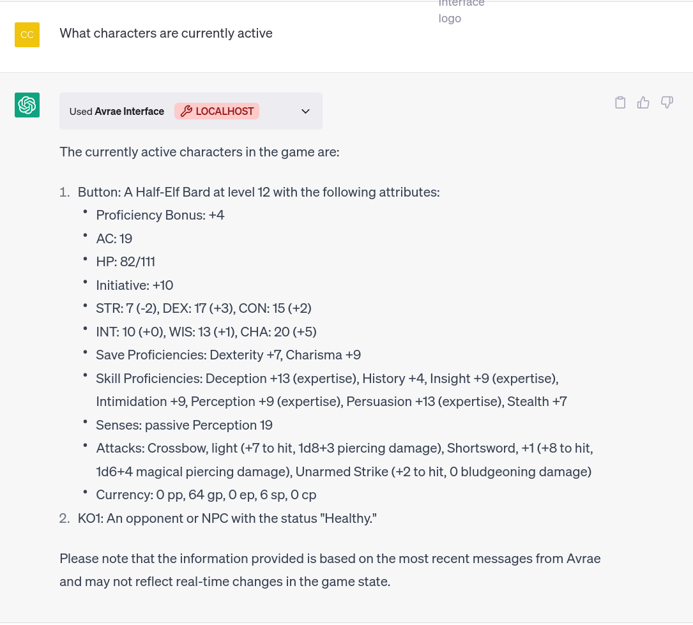

# Avrae-ChatGPT Plugin
This is a chatgpt plugin that allows ChatGPT to get game state from discord servers that use Avrae.

This is definitely rather rudimentary at the moment since Avrae ignores other bots (this is a Discord requirement) - which means that it can currently
1. Suggest Avrae commands
1. Reason on top of the game state by getting a channel's history of messages.

This plugin uses discord-py and Quart. It was set up very similarly to the [OpenAI Todo app example](https://platform.openai.com/docs/plugins/examples) [version in FastAPI here](https://github.com/CalmDownKarm/automatic-adventure/blob/main/Readme.md)

To use it you need the following
1. Discord Bot Token. Instructions to get one [here](https://discordpy.readthedocs.io/en/stable/discord.html)
1. You need to add Avrae to your discord server, instructions to do that are on the [avrae website](http://avrae.io/) Once you've added avrae, get the user id of the avrae user and change the appropriate key in bot.py
1. Similarly get the server id and channel id of your server/game channel on discord and replace the keys. 
1. Access to OpenAI ChatGPT Plugins.

# Current Functionality
* `/get_state` passes chatgpt all the messages from the avrae bot that were issued in the channel, Chatgpt can then reason on top of the game state as demonstrated in the following images.
* To set up the scenario, I created a character on DnD Beyond, imported it into Avrae via !import, and then created a combat via !init. This is standard for Avrae. I then had to use the !sheet command, to post the character information into the channel, otherwise ChatGpt can only get the characters that are in the combat, without getting information about the characters and their abilities themselves.

* Once chatgpt gets the state, it caches it locally automatically and minimizes the number of calls to discord, you might need to prompt it to refresh the state if it changes dramatically.

* The plugin can also suggest avrae commands to the user zero shot. Currently the targeting isn't perfect. 

# TODO
1. Swap out the Discord bot for a Userbot - this would allow chatgpt to talk directly to avrae
1. Add support for common item/spell lookup commands so that players can pull in information from DnD Beyond. 
